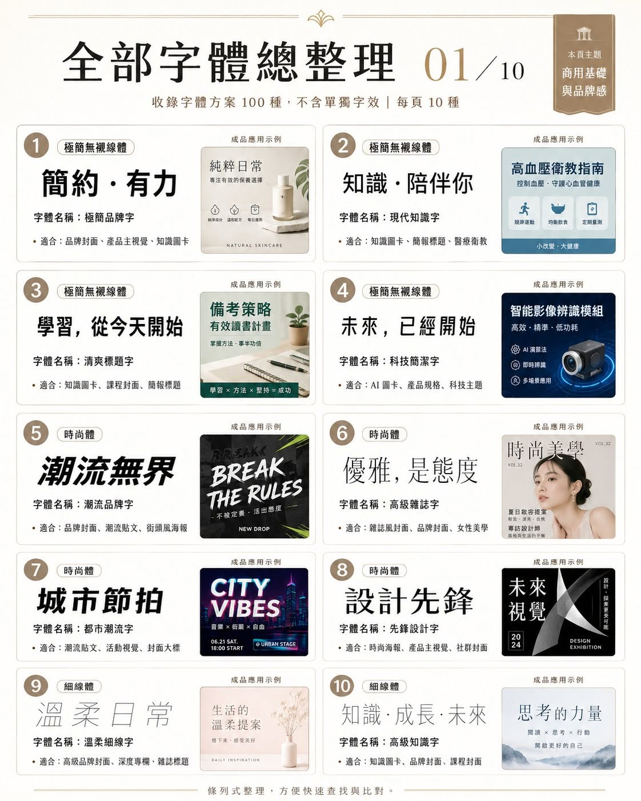
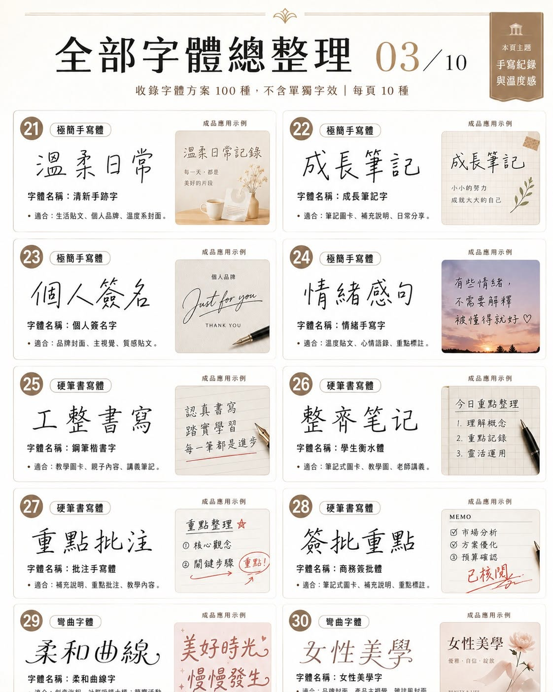
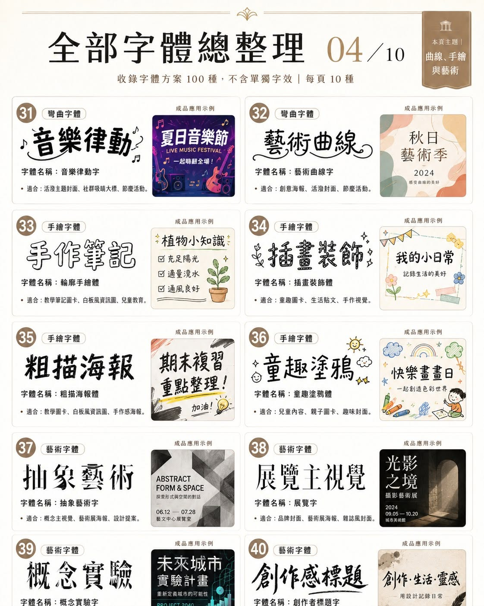
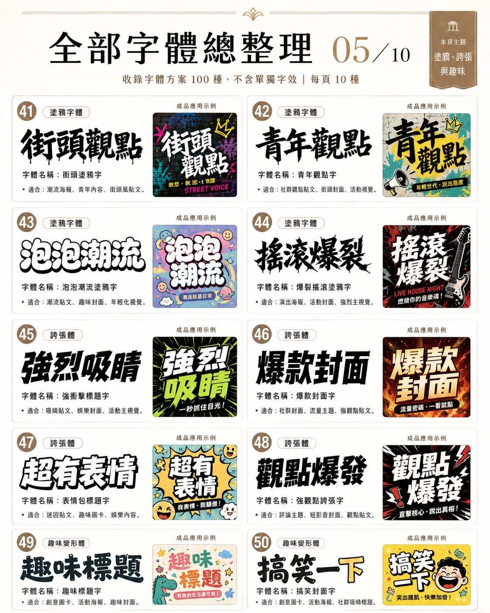
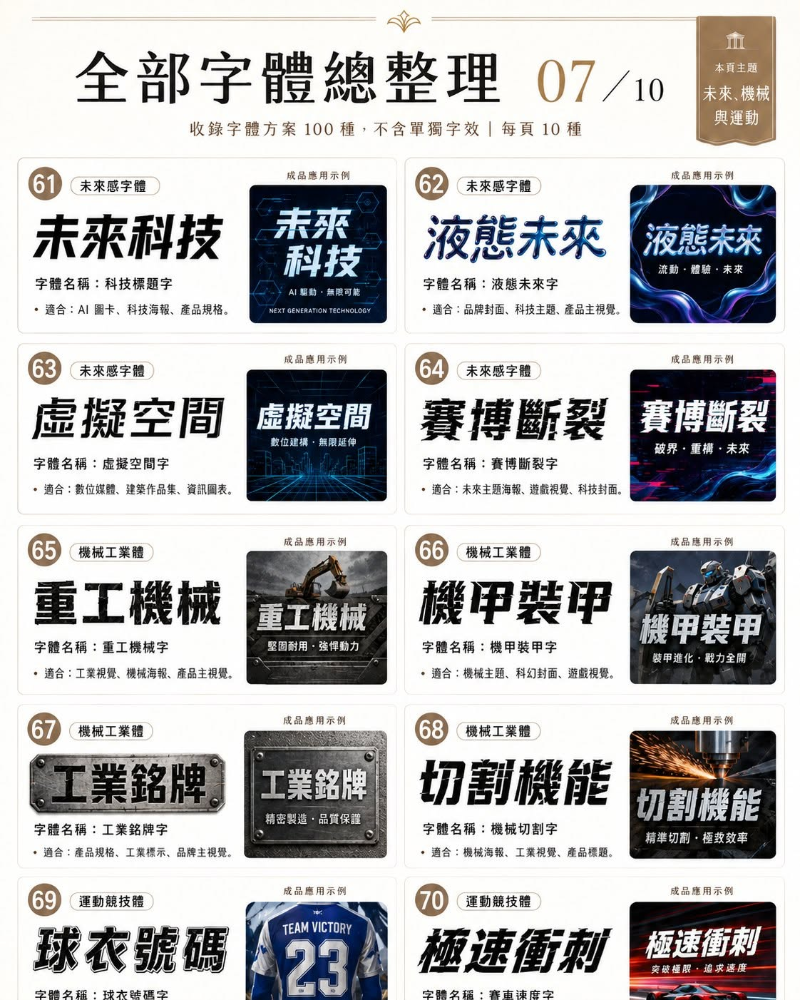
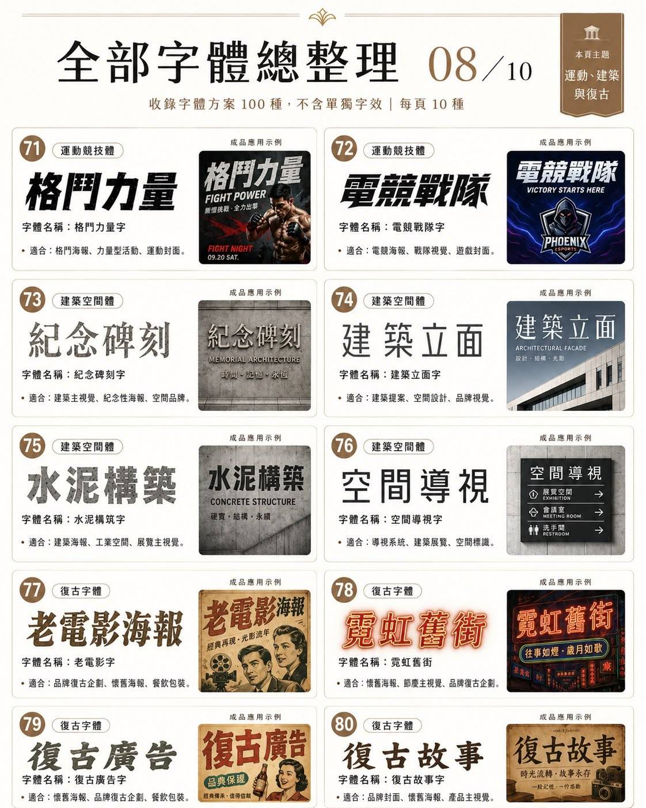
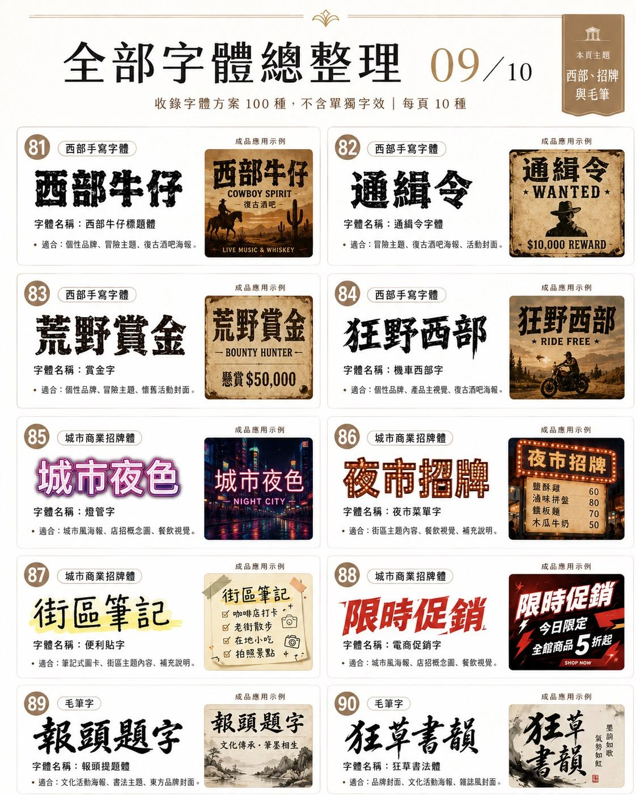
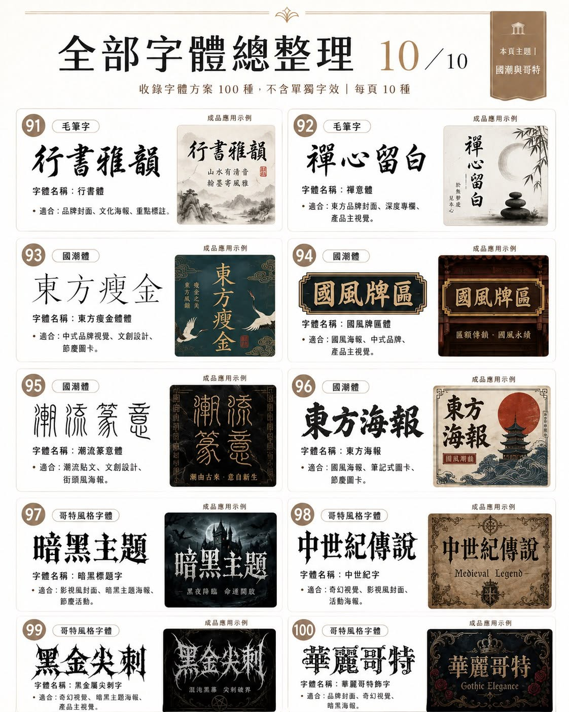

# AI 繪圖字體風格庫

**線上版(可搜尋+一鍵複製提示詞):https://yazelin.github.io/ai-font-styles/**

從 100 種 AI 生圖用的「字體風格名稱」起家,每天自動擴充一種,分 10 類,附實際應用成品對照。

這些不是真實字型檔,是拿來寫進提示詞的**風格描述詞**。做圖卡、封面、海報時,直接指定字體風格,比說「幫我換一個好看的字」快很多,也比較不會得到方向完全不對的結果。

## 提示詞用法

任何圖卡生成都適用,格式:

```
[主題與內容描述]
標題使用「科技標題字」,內文使用「現代知識字」
[版型、情緒、使用場景描述]
```

把字體名稱、主題、情緒、版型和使用場景一起寫清楚,生成結果通常更接近想要的效果。

## 適用場景

- 社群貼文標題
- IG、FB 輪播封面
- 品牌與產品主視覺
- 知識圖卡與醫療衛教
- 活動、促銷及課程海報
- 童趣、復古、科技與潮流內容

## 實測效果圖

每種字體都有兩張實測生成圖(gpt-image 真實輸出,非示意):

- `samples/` — **純字效果**:字體風格名稱本身以該風格呈現,prompt 為「風格名稱+一句風格描述」
- `samples/apps/` — **應用效果**:把該字體套進真實設計場景(知識圖卡、雜誌封面、促銷廣告、遊戲海報…)的迷你成品

每 10 種合排一張的原稿在 `samples/sheets/`(`sheet-*` 純字、`app-sheet-*` 應用),完整生成 prompt 在 `tools/gen-sheets.sh` 與 `tools/gen-app-sheets.sh`,錯字格單獨重生的修正 prompt 在 `tools/gen-app-fixes.sh`,裁切/貼回腳本也都在 `tools/`。

線上版每個字體條目並列顯示「字/應用」兩張效果圖,並提供兩顆複製鈕:字體提示詞(純字公式)與應用提示詞(含該格實測用的場景描述)。

## 每日自動擴充

100 種之後,這個庫每天自動長出一種新字體(GitHub Actions,台北時間 10:30):

1. 從 `queue.json` 候選佇列取出第一筆(名稱、風格描述、應用場景都預先寫好,佇列可隨時手動增刪排序)
2. 打自架的 [codex-image-service](https://github.com/yazelin/codex-image-service) 生成純字圖與應用圖
3. Gemini 視覺驗字:繁體字形、無錯漏字、風格符合名稱——單圖最多重生 3 次,全過才上線
4. 寫入 `fonts.json` 並 commit,Pages 自動更新

擴充字體在站上標「擴充」徽章,與阿吉原整理的 100 種明確區分;pipeline 程式在 `tools/daily_font.py`。

候選佇列採低水位補貨:`queue.json` 剩不到 14 筆時,workflow 會自動開 issue 提醒。收到後批次補約 20 個新候選(跟全表查重、補分類缺口),走 PR 人工審過再合——選題不全自動,品味留在人手上。

補貨寫 `desc` 時要交代**筆畫怎麼構成**(線條走向、堆疊方式、鑲嵌結構、書寫筆觸…),不能只寫材質形容詞(「金屬感」「絨毛感」這種字眼不夠具體);如果風格本身隱含特定背景(黑板、液面、夜空…),desc 也要點出來,不能假設一律白底——不然生圖時容易退化成通用字體只換皮,或跟預設白背景打架。

補貨也要一併寫 `headline`:應用圖的主標題文字,要是那個 `app` 場景裡**真的會出現的一句標語**(例如電路板字配「DEV CONF 2026」,不能就寫字體名稱本身「電路板字」)——不然應用圖看起來只是字體名稱被貼到背景裡,不像真實案例。純字圖不受影響,純字圖本來就是拿字體名稱自己當展示文字。

## 字體總覽

每種字體的展示效果與「適合場景」請看對應圖卡。

### 01|商用基礎與品牌感



1. 極簡品牌字
2. 現代知識字
3. 清爽標題字
4. 科技簡潔字
5. 潮流品牌字
6. 高級雜誌字
7. 都市潮流字
8. 先鋒設計字
9. 溫柔細線字
10. 高級知識字

### 02|優雅襯線與細線


11. 未來細線字
12. 輕奢細線字
13. 雜誌襯線體
14. 商業襯線體
15. 輕奢封面字
16. 深度專欄字
17. 連續線稿體
18. 草圖單線體
19. 科技線框字
20. 優雅單線字

### 03|手寫紀錄與溫度感



21. 清新手跡字
22. 成長筆記字
23. 個人簽名字
24. 情緒手寫字
25. 鋼筆楷書字
26. 學生衡水體
27. 批注手寫體
28. 商務簽批體
29. 柔和曲線字
30. 女性美學字

### 04|曲線、手繪與藝術



31. 音樂律動字
32. 藝術曲線字
33. 輪廓手繪體
34. 插畫裝飾體
35. 粗描海報體
36. 童趣塗鴉體
37. 抽象藝術字
38. 展覽字
39. 概念實驗字
40. 創作者標題字

### 05|塗鴉、誇張與趣味



41. 街頭塗鴉字
42. 青年觀點字
43. 泡泡潮流塗鴉字
44. 爆裂搖滾塗鴉字
45. 強衝擊標題字
46. 爆款封面字
47. 表情包標題字
48. 強觀點誇張字
49. 趣味標題字
50. 搞笑封面字

### 06|童趣、課程與像素


51. 創意課程字
52. 兒童活動字
53. 兒童繪本體
54. 樂高玩具體
55. 零食包裝字
56. 剪紙拼貼字
57. 復古遊戲字
58. 街機遊戲字
59. 像素字
60. 方塊模塊字

### 07|未來、機械與運動



61. 科技標題字
62. 液態未來字
63. 虛擬空間字
64. 賽博斷裂字
65. 重工機械字
66. 機甲裝甲字
67. 工業銘牌字
68. 機械切割字
69. 球衣號碼字
70. 賽車速度字

### 08|運動、建築與復古



71. 格鬥力量字
72. 電競戰隊字
73. 紀念碑刻字
74. 建築立面字
75. 水泥構築字
76. 空間導視字
77. 老電影字
78. 霓虹舊街
79. 復古廣告字
80. 復古故事字

### 09|西部、招牌與毛筆



81. 西部牛仔標題體
82. 通緝令字體
83. 賞金字
84. 機車西部字
85. 燈管字
86. 夜市菜單字
87. 便利貼字
88. 電商促銷字
89. 報頭提題體
90. 狂草書法體

### 10|國潮與哥特



91. 行書體
92. 禪意體
93. 東方瘦金體
94. 國風牌匾體
95. 潮流篆意體
96. 東方海報
97. 暗黑標題字
98. 中世紀字
99. 黑金屬尖刺字
100. 華麗哥特飾字

## 來源

圖卡與字體名稱整理來自「數位生活小記 阿吉」的 Facebook 粉絲團貼文《做圖卡不要只顧漂亮。|第四篇》,歡迎追蹤:https://www.facebook.com/profile.php?id=61589913332541

本 repo 僅作提示詞參考整理,內容著作權歸原作者所有。

---

整理:[GitHub](https://github.com/yazelin) | [Facebook](https://www.facebook.com/yaze.lin.gm) | [Buy Me a Coffee](https://buymeacoffee.com/yazelin)
